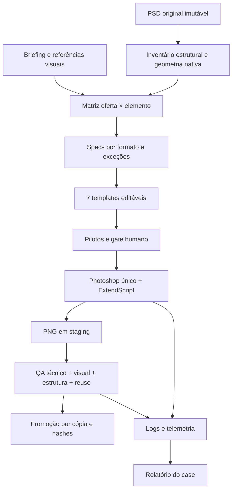

# 2. Arquitetura real e autoridade dos dados

## Camadas de responsabilidade

| Camada | Tecnologia concreta | Responsabilidade |
|---|---|---|
| Decisão | agente head e humano | composição, exceções, gate e revisão |
| Conteúdo | JSON/TSV + referências | oferta, origem, selos, restrições |
| Estado gráfico | PSD, grupos, Layer Comps | fontes editáveis e estados por oferta |
| Motor | ExtendScript no Photoshop | duplicar/reorganizar camadas, aplicar estado, exportar |
| Organização/QA | Python, psd-tools, Pillow, hashes | estrutura, dimensões, perfil, contagem, evidências |
| Coordenação | lock mkdir e logs | exclusão de operador e rastreabilidade |

Não foi implementado um serviço de fila distribuída ou uma API de render. A automação é local macOS/Photoshop, orquestrada por agentes e scripts.

## Fontes de verdade

Todos os caminhos abaixo são relativos a `workspace/Projects/BYD/Jobs/V4/`.

| Pergunta | Autoridade |
|---|---|
| Qual material foi recebido? | INPUT e WORK/00_MATRIZ/input_baseline_observado_sha256_v2.json |
| Qual é o escopo final? | WORK/00_MATRIZ/production_spec_r18.json |
| Quais ajustes finais entram? | WORK/00_MATRIZ/layout_adjustments_r18.json |
| Quais PSDs usar? | WORK/04_QA/production-r18/templates_manifest_r18.json |
| Quais imagens representam fechamento? | OUTPUT/2026-09-20-r18 e WORK/04_QA/manifest.json |
| Como reproduzir estado? | WORK/REUSO_TEMPLATES.md e render_canonical_v2.jsx |
| Quanto durou/consumiu? | WORK/04_QA/process-audit-r18/metrics.json |
| O que ocorreu e foi decidido? | WORK/06_LOGS/DIARIO.md e logs de cada run |

## Estrutura interna do PSD

Raízes: `#GUIAS`, `FIXO`, `OFERTA`, `CONDICIONAIS`, `LEGAL`, `VEICULO`, `BG`. O reuso aplica a Layer Comp `OFERTA <offer_id>` e exige exatamente um estado correspondente visível nos cinco ramos variáveis BG/VEICULO/LEGAL/CONDICIONAIS/OFERTA. Carro usa `CAR · <offer_id>`; condicionais usam `COND · <offer_id>`. `#GUIAS` fica oculto na exportação.

O spec não é apenas copy literal: campos como title/price/legal/car são IDs de camadas do PSD inventariado. `anchor_id`, caminhos e geometria resolvem a origem real; `extras`, `embedded_tags`, `hide_in_car_name` e `micro_dual` representam exceções. Um novo PSD exige remapeamento; IDs não são universais. As zonas por formato definem coordenadas e funções visuais; ajustes finais também estão em layout_adjustments e nas fichas.

## Proveniência da revisão final

A escala passou por R03/R10, patches R14/R16 e assembly R11. O fechamento documental é R18. Os templates finais residem em pasta R17: strip validado em trecho concluído de R17; seis formatos gerados por R20. R19 falhou sem salvar PSD. O estado de visibilidade foi reparado depois da escala: portanto `build_production_r10.jsx` sozinho não produz todo o estado final validado. Não transforme a sequência histórica em pipeline automático sem refatorar e testar.

A matriz final é autoridade de escopo, mas o case ainda possui revisões de ajustes e patches em scripts. A meta de uma única configuração integral precisa de engenharia adicional; não afirmar que toda a construção final já depende exclusivamente de um JSON.

## Evolução da matriz

production_offers_20.json é uma etapa intermediária: registra 19 READY e um bloqueado. O spec R18 registra 20 READY. Não usar o primeiro como escopo final. data/offers_final.csv e data/format_zones.csv são extrações legíveis do spec final; IDs permanecem vinculados ao inventário do PSD original.

## Ressalva de integridade do handoff

Os 140 PNGs exatos do fechamento estão em [resultado_historico_R18](../resultado_historico_R18/), recuperados e verificados por SHA-256. A V4 integral preserva o estado encontrado, incluindo cinco PNGs posteriores no OUTPUT. Os sete PSDs canônicos coincidem com o manifesto histórico. Consulte [a reconciliação de versões](12_INTEGRIDADE_E_VERSOES_POSTERIORES.md) antes de usar o OUTPUT como evidência da entrega original.
