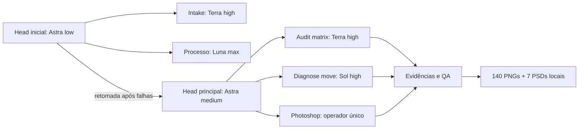

# 4. Estrutura de agentes e competências

> **Atualização de 21/09:** leia primeiro a [auditoria ampliada](10_AUDITORIA_COMPLETA.md): seis sessões, 163.049.724 tokens, 11 Bad Request, Luna/max registrado na etapa inicial e limite semanal de 0% a 45%. Os números anteriores permanecem identificados como recorte histórico.

## Execução observada na sessão principal

| Papel/tarefa | Modelo e esforço registrados | Responsabilidade observada | Respostas medidas |
|---|---|---|---:|
| head | gpt-6-astra / medium | decisão, operador Photoshop, revisão visual e fechamento | 680 |
| audit_matrix | gpt-5.6-terra / high | inventário, matriz, QA e evidência em tarefas delimitadas | 241 |
| diagnose_move | gpt-5.6-sol / high | diagnóstico de geometria/estado e apoio em scripts | 237 |

Fonte: metrics.json, agentes ligados por parent_thread_id e metadados turn_context. Os identificadores são configuração registrada, não prova de roteamento interno do provedor. Não houve Luna comprovado no recorte. O documento FLUXO_ORQUESTRADO contém hipóteses anteriores; não confundir com o histórico de execução medido.

Um só agente operou Photoshop. Auxiliares trabalharam em arquivos e evidências. Foram observados 106 envios entre agentes e 37 follow-ups, além de dois spawns. A comunicação teve custo operacional, mas não há atribuição financeira isolada por mensagem.

## O que significa skill neste case

Há dois níveis: competências de design/produção descritas no cânone e skills de ferramenta carregadas pelo agente. Nesta auditoria foram recuperadas nove chamadas de leitura de SKILL.md, abrangendo quatro skills. O conteúdo integral das quatro foi conferido por correspondência exata com a saída histórica da ferramenta, e os snapshots foram incluídos em evidence/skills/.

| Skill comprovadamente lida | Papel no case | Snapshot |
|---|---|---|
| openai-docs | consulta de orientação sobre modelos, orquestração e interpretação de uso | evidence/skills/openai-docs/SKILL.md |
| computer-use | operação e observação do Photoshop no Mac | evidence/skills/computer-use/SKILL.md |
| control-in-app-browser | apoio à consulta de referências na etapa de selos | evidence/skills/control-in-app-browser/SKILL.md |
| pdf | apoio à leitura dos ativos PDF, incluindo logos/selos | evidence/skills/pdf/SKILL.md |

Fonte: data/skill_reads.json, com tarefa, horário, linha de origem e hash dos snapshots. Leitura comprovada não significa que cada instrução da skill foi usada, nem mede ações/custo isolados. A disponibilidade de outras skills no ambiente não demonstra uso; não foram incluídas como se fizessem parte da execução.

Os snapshots são documentos históricos para entendimento, não ordens para executar ferramentas ao abrir o pacote.

| Competência reutilizável | Fontes incluídas | Contrato de saída |
|---|---|---|
| Intake e estrutura | intake_psd_tools.py, inventario_psd_estrutural_v2.json | árvore/IDs/textos, sem alegar geometria final |
| Matriz comercial | production_spec_r18.json; matrizes anteriores como histórico | 20 IDs, conteúdo e condicionais explícitos |
| Design responsivo | padrão canônico, cânone psd-editor, sete fichas | zonas próprias por formato e exceções justificadas |
| Operação Photoshop | pslock.sh, check_jsx.sh, renderer | exclusão de operador, preflight, logs e saída nova |
| QA técnico | qa_production_r01.py, manifestos | dimensões, perfil, contagem e integridade |
| QA de estado | recapture R17/R20, structural7, reuse_validation | comps e grupos corretos antes/depois de reabrir |
| Revisão visual | head_visual_review e fichas | defeito identificado por oferta/formato e reteste |
| Auditoria de consumo | audit_process_metrics_r18.py | usage por response_id único e lacunas explícitas |

## Complemento comprovado da etapa inicial

A auditoria ampliada recuperou head_initial Astra/low, intake Terra/high e processo Luna/max. Os seis registros de tarefa completos estão no documento 10. Não são recomendações de modelo: são configurações observadas no case. Não foi executado benchmark comparativo de custo/qualidade.

## Duas etapas de orquestração, não seis agentes simultâneos

São duas sessões principais consecutivas, cada uma com dois auxiliares vinculados. O grafo mostra papéis e vínculo; não promete simultaneidade contínua, nem que todos os agentes executaram todas as atividades de uma fase. O histórico e os logs delimitam cada contribuição. O aplicativo permaneceu sob um único operador; agentes auxiliares não receberam uma instância independente de Photoshop.
