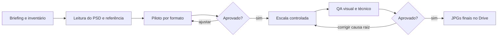

# SOP canônico — fluxo de produção

## Objetivo

Converter PSDs, referências e ativos oficiais em JPGs finais para concessionárias com precisão visual, escala controlada e rastreabilidade de entrega.

## Portões do fluxo

## 1. Intake e inventário

- Registrar cliente, campanha, prazo, formatos, pesos máximos, modelos, ofertas, fonte oficial e exclusões (por exemplo, CTA de interface).
- Manter os recebidos em `01_INPUTS_ORIGINAIS`; nunca trabalhar sobre o único original.
- Listar PSDs, fundos, recortes de carro, logos, selos, fontes, referências e comentários de revisão.
- Confirmar se há camadas ou grupos desativados relevantes antes de alterar qualquer peça.

**Saída do portão:** inventário e [[05 Templates/Template novo case|ficha do case]] preenchidos.

## 2. Leitura estrutural do PSD

Antes de editar, abrir cada PSD e mapear:

- tamanho da prancheta e formato;
- grupos de `BG`/fundo, carro/Smart Object, copy, oferta, logos, rodapé, legais e CTA;
- visibilidade e opacidade de camadas;
- fontes e estilos de texto;
- Smart Objects substituíveis;
- grupos de variação já existentes.

**Regra:** reutilizar a camada existente sempre que ela resolver a mudança. Não rasterizar texto, nem reconstruir logo, rodapé ou oferta sem necessidade.

## 3. Piloto por formato

Criar um exemplar para cada formato solicitado usando os ativos corretos. O piloto deve provar simultaneamente:

- proporção e direção do carro;
- leitura de copy e contraste;
- adaptação real do layout ao formato;
- rodapé e logos corretos;
- peso e dimensão exigidos.

O piloto não é uma prévia descartável: ele se torna o padrão para automatização e escala.

Antes de apresentar o piloto, registrar os limites visíveis de nome, oferta, carro e selo. Reprovar automaticamente qualquer cruzamento e conferir o respiro mínimo definido em [[02 Padrões de Design/01 Composição, carro e copy|Composição, carro e copy]]. A prancha não substitui a revisão de cada JPG a 100%.

## 4. Execução da arte

Seguir a ordem:

1. Fundo e contraste.
2. Carro e sombra/contato com o piso.
3. Modelo, oferta, condição e legais.
4. Logos e selos.
5. Rodapé.
6. Remoção de CTA/interface que não pertença à peça final.

Ver detalhes em [[02 Padrões de Design/01 Composição, carro e copy|Composição, carro e copy]] e [[02 Padrões de Design/03 Rodapé Volkswagen Servopa|Rodapé Volkswagen Servopa]].

## 5. Escala controlada

Só depois de aprovar o piloto:

- montar uma matriz: PSD → modelo → formato → copy → preço → condição → recorte → fundo;
- automatizar substituições repetitivas por nomes de camadas conhecidos;
- registrar um log por arquivo (`OK` ou `ERRO|motivo`);
- tratar exceções individualmente; não regenerar um lote bom por causa de uma peça.

A automação deve abrir cópias de trabalho, aplicar mudanças sem salvar sobre a origem e exportar JPGs. Ver [[06 Automação e Scripts/01 Automação segura com PSD|Automação segura com PSD]].

## 6. QA e correção

Executar primeiro [[03 QA e Entrega/01 QA visual|QA visual]], depois [[03 QA e Entrega/02 QA técnico|QA técnico]]. Comentários devem ser agrupados por causa raiz: rodapé, contraste, texto, corte ou perspectiva. Corrigir no processo/PSD, não apenas no JPG isolado.

## 7. Empacotamento e Drive

- A pasta de envio contém somente JPGs finais.
- Pranchas, manifesto e checksums ficam em pasta de QA separada.
- Confirmar contagem, dimensões, RGB e SHA-256 antes e depois da sincronização.
- Usar nomes estáveis: `marca_modelo_formato_larguraxaltura_vN.jpg`.

Ver [[03 QA e Entrega/03 Drive, versões e rastreabilidade|Drive, versões e rastreabilidade]].
